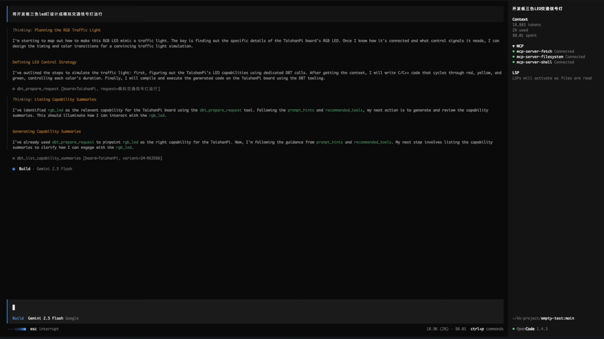
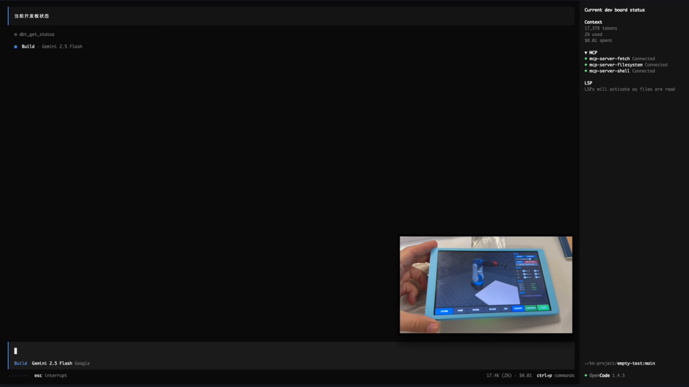

# DBT-Agent Plugins

Platform plugin delivery repository for the Development Board Toolchain (`DBT-Agent`).

This plugin workspace is authoritative only for platform plugin delivery under the current
`DBT-Agent-Project` tree. Runtime-side source changes belong in the sibling `../dbt-agentd/`
project inside the same workspace, not in external historical workspaces.

This repository currently contains two platform-specific plugin projects:

- `opencode_plugin/`
  - OpenCode plugin source, release package, installer, and docs
- `codex_plugin/`
  - Codex plugin source, release package, installer, and docs

## What This Repository Provides

| Platform | Status | Project folder | Install entry | Notes |
| --- | --- | --- | --- | --- |
| OpenCode | available | `opencode_plugin/` | `opencode_plugin/release/install.sh` | Includes demo videos in `demo/` |
| Codex | available | `codex_plugin/` | `codex_plugin/release/install.sh` | Demo videos will be added later |

## Repository Layout

```text
.
├── README.md
├── DBT-Agent-Plugins.md
├── demo/
│   ├── opencode_led_traffic_light.webm
│   ├── opencode_change_logo.webm
│   └── posters/
├── opencode_plugin/
│   ├── source/
│   ├── release/
│   ├── docs/
│   └── scripts/
└── codex_plugin/
    ├── source/
    ├── release/
    ├── docs/
    └── scripts/
```

## Quick Start

Both platform plugins use the shared local Development Board Toolchain runtime:

- runtime root:
  - `~/Library/development-board-toolchain/runtime`

OpenCode install:

```bash
/bin/bash ./opencode_plugin/release/install.sh --force
```

Codex install:

```bash
/bin/bash ./codex_plugin/release/install.sh --force
```

Detailed installation guides:

- [OpenCode installation](./opencode_plugin/docs/installation.md)
- [Codex installation](./codex_plugin/docs/installation.md)

Release entry for end users:

- [release/README.md](./release/README.md)
- [GitHub Releases](https://github.com/kkwell/DBT-Agent-Plugins/releases)
- generic installer:
  - `./release/install.sh --platform <opencode|codex> --check-only`
- platform installers:
  - `./release/install-opencode.sh`
  - `./release/install-codex.sh`
- downloadable archives:
  - `DBT-Agent-OpenCode-v1.0.13.zip`
  - `DBT-Agent-Codex-v1.0.13.zip`
- offline runtime download:
  - [Baidu Netdisk runtime package](https://pan.baidu.com/s/1SVGvOmNEWLoALkf7Sfi0dQ?pwd=0001)
  - password: `0001`

Runtime note:

- the shared DBT runtime and `dbt-agentd` are not auto-downloaded by this repository
- the runtime package is distributed offline because it contains large cross-compilers and board toolchains
- board-family development environments are also offline/manual packages:
  - a user who installed only the TaishanPi environment and later wants to use an RP2350 board such as `RaspberryPiPico2W` must download and install the `RP2350` offline package before local firmware builds can run
  - the same rule applies in reverse for TaishanPi or future board families
- `opencode-plugin-release-manifest.json` is the shared plugin/update manifest for OpenCode and for model-facing board-environment guidance
- the macOS GUI release is a separate optional repository/channel; it is not required for core model-driven board control
- Codex now launches the installed `dbt-agentd` binary directly through native MCP stdio mode
- the Codex installer runs a native MCP probe before install, so older runtime bundles are rejected early
- if a plugin task also requires runtime-side code changes, modify `DBT-Agent-Project/dbt-agentd/` and then sync the plugin-facing docs here

## OpenCode Demos

Click a cover image to open the demo video.

| LED traffic light workflow | Change logo workflow |
| --- | --- |
| [](./demo/opencode_led_traffic_light.webm) | [](./demo/opencode_change_logo.webm) |
| Generate and run an LED traffic light flow through the OpenCode + DBT-Agent workflow. | Update the device logo through the OpenCode + DBT-Agent workflow. |

Direct video links:

- [OpenCode LED traffic light demo](./demo/opencode_led_traffic_light.webm)
- [OpenCode change logo demo](./demo/opencode_change_logo.webm)

## Plugin Details

OpenCode project details:

- [OpenCode plugin README](./opencode_plugin/README.md)

Codex project details:

- [Codex plugin README](./codex_plugin/README.md)

Additional repository-level background:

- [DBT-Agent-Plugins.md](./DBT-Agent-Plugins.md)

## Notes

- This repository keeps each platform plugin self-contained in its own directory.
- OpenCode demos are included now.
- Codex demo videos will be added after the demo assets are ready.
